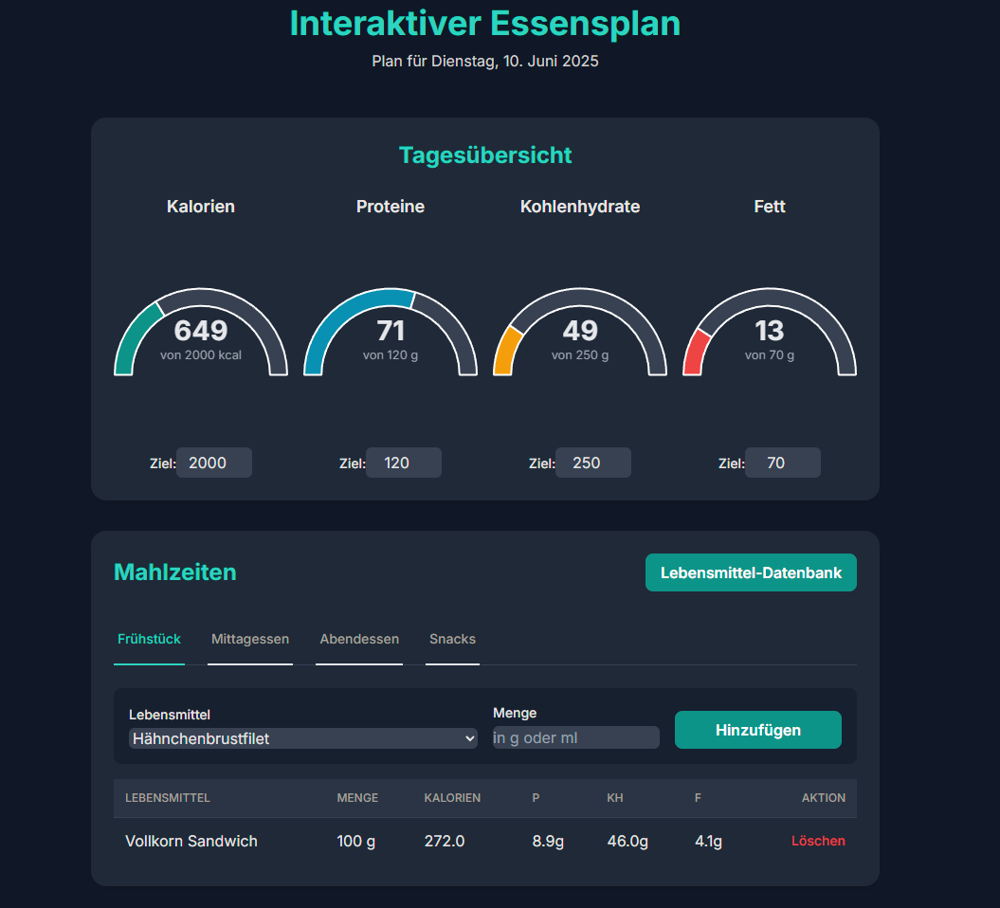

# EatSmart: Interaktiver Essensplan

[Web-App](https://mazls.github.io/eatsma/)

Das ist mein interaktiver Essensplan, den ich als Webanwendung entwickelt habe. Er hilft mir dabei, meine tägliche Ernährung zu verfolgen und meine Fitness-Ziele zu analysieren. Die App wird als einzelne HTML-Seite ausgeführt und nutzt Firebase zur Datenspeicherung und Synchronisation in Echtzeit über mehrere Geräte hinweg.

<p align="center"> 
  
</p>

## Features

* **Tages-Dashboard:** Visuelle Übersicht der aktuellen Kalorien- und Makronährstoffaufnahme mit dynamischen Diagrammen.
* **Detaillierte Mahlzeiten-Erfassung:** Eintragen von Lebensmitteln für Frühstück, Mittagessen, Abendessen und Snacks.
* **Persönliche Lebensmittel-Datenbank:** Speichern Sie Ihre eigenen Lebensmittel für den schnellen Zugriff.
* **Online-Suche:** Integrierte Suche über die [Open Food Facts](https://world.openfoodfacts.org/)-API zum schnellen Hinzufügen von neuen Lebensmitteln.
* **Kalender-Ansicht:** Blättern Sie durch vergangene Tage, um Ihre Einträge und Erfolge zu sehen.
* **Persönliche Auswertung:**
    * **Gewichts-Tracker:** Erfassen Sie Ihr Gewicht und verfolgen Sie Ihren Fortschritt in einem Liniendiagramm im Vergleich zu Ihrem Zielgewicht.
    * **Wochen-Analyse:** Automatische Auswertung der durchschnittlichen Kalorien- und Makroaufnahme sowie Ihrer Kalorienbilanz der letzten 7 Tage.
* **Anpassbare Referenzwerte:** Eine integrierte, filterbare Tabelle mit allgemeinen Nährstoff-Referenzwerten für verschiedene Altersgruppen und Geschlechter.
* **Google Authentifizierung:** Sicherer Login mit Ihrem Google-Konto zur Synchronisation Ihrer Daten auf all Ihren Geräten.
* **Dark & Light Mode:** Passen Sie das Erscheinungsbild der App an Ihre Vorlieben an.

## Verwendete Technologien

* **Frontend:** HTML5, Tailwind CSS, Vanilla JavaScript (ES6 Modules)
* **Visualisierung:** Chart.js
* **Backend & Datenbank:** Google Firebase (Authentication & Firestore)
* **Externe APIs:** Open Food Facts API

## Einrichtung

Um die Anwendung für sich selbst zu nutzen, müssen Sie ein eigenes Firebase-Projekt einrichten.

**1. Firebase-Projekt erstellen:**
* Gehen Sie zur [Firebase Console](https://console.firebase.google.com/) und erstellen Sie ein neues Projekt.
* Fügen Sie eine neue **Web-App** zu Ihrem Projekt hinzu.
* Sie erhalten ein `firebaseConfig`-Objekt. Kopieren Sie dieses.

**2. Firebase-Konfiguration einfügen:**
* Öffnen Sie die `index.html`.
* Suchen Sie im `<script>`-Block am Ende der Datei nach der `firebaseConfig`-Konstante und ersetzen Sie diese durch Ihre eigene Konfiguration.

**3. Authentifizierungsmethoden aktivieren:**
* Gehen Sie in Ihrer Firebase-Konsole zu **Authentication** -> **Sign-in method**.
* Aktivieren Sie den Anbieter **Google**.
* Stellen Sie sicher, dass Sie eine Projekt-Support-E-Mail auswählen.

**4. Firestore-Datenbank einrichten:**
* Gehen Sie zu **Firestore Database** und klicken Sie auf **Datenbank erstellen**.
* Starten Sie im **Produktionsmodus**.
* Wählen Sie einen Standort (z.B. `eur3 (frankfurt)`).

**5. Sicherheitsregeln konfigurieren:**
* Navigieren Sie in Ihrer Firestore-Datenbank zum Tab **Regeln**.
* Ersetzen Sie den gesamten Inhalt durch die folgenden Regeln. Diese sind entscheidend, damit jeder Nutzer nur seine eigenen Daten sehen und bearbeiten kann.
    ```javascript
    rules_version = '2';
    service cloud.firestore {
      match /databases/{database}/documents {
        // Erlaube jedem angemeldeten Benutzer, nur auf seine eigenen Daten zuzugreifen.
        match /users/{userId}/{document=**} {
          allow read, write: if request.auth.uid == userId;
        }
      }
    }
    ```
* Klicken Sie auf **Veröffentlichen**.

## Lokale Ausführung (Wichtig!)

Die App nutzt JavaScript-Module. Aus Sicherheitsgründen blockieren die meisten Browser das Laden dieser Module, wenn Sie die `index.html` direkt als Datei (`file:///...`) öffnen. Sie müssen die App daher über einen lokalen Webserver aufrufen.

Der einfachste Weg ist mit Python:

1.  **Kommandozeile öffnen:**
    * Öffnen Sie die Kommandozeile (auf Windows `cmd`, auf Mac/Linux das `Terminal`).
2.  **Zum Projektordner navigieren:**
    * Wechseln Sie mit dem `cd`-Befehl in den Ordner, in dem Ihre `index.html` und `dge-data.js` liegen.
        ```sh
        cd Pfad/zu/Ihrem/Projektordner
        ```
3.  **Lokalen Server starten:**
    * Führen Sie den folgenden Befehl aus:
        ```sh
        python -m http.server 8000
        ```
    * *(Falls das nicht klappt, versuchen Sie es mit `python3` anstelle von `python`)*.
4.  **App im Browser öffnen:**
    * Öffnen Sie Ihren Webbrowser und gehen Sie zur folgenden Adresse:
        ```
        http://localhost:8000/index.html?
        ```

## Veröffentlichung (GitHub Pages)

1.  Benennen Sie Ihre Hauptdatei in `index.html` um.
2.  Laden Sie die `index.html` und die `dge-data.js` in Ihr GitHub-Repository hoch.
3.  Gehen Sie in den Repository-Einstellungen zu **Settings** > **Pages**.
4.  Wählen Sie unter "Branch" den `main`-Branch aus und klicken Sie auf **Save**.
5.  **Wichtig:** Fügen Sie Ihre GitHub-Pages-URL (z.B. `ihr-name.github.io`) zu den **autorisierten Domains** in den Firebase **Authentication**-Einstellungen hinzu, damit die Google-Anmeldung funktioniert.

---
*Dieses Projekt wurde zu Lern- und Demonstrationszwecken erstellt.*
